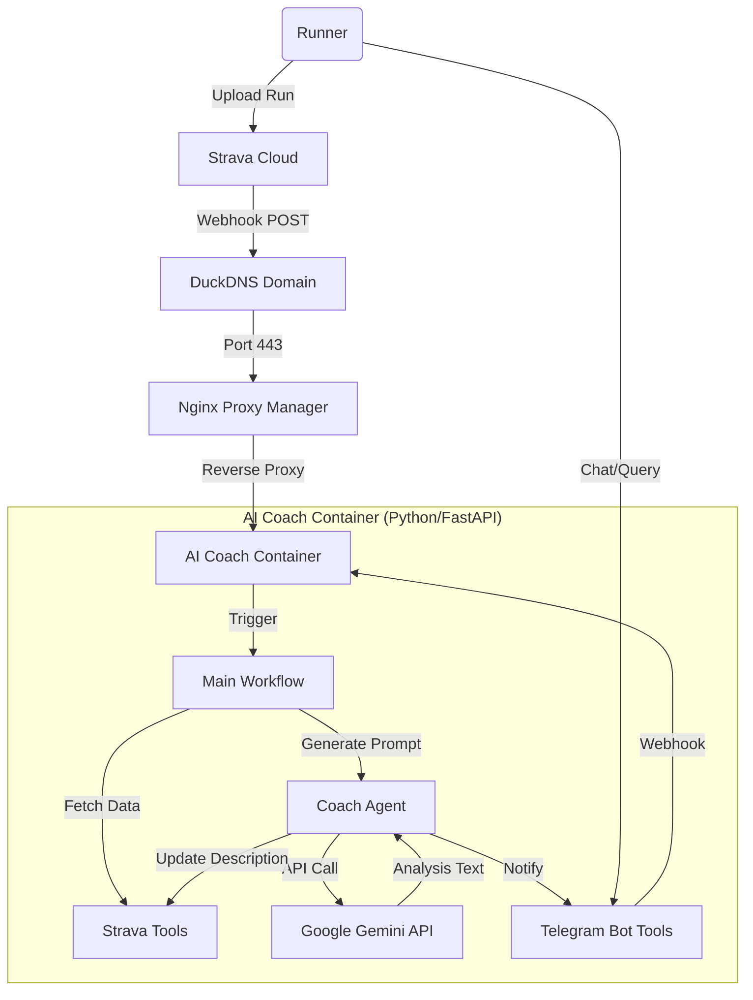

---

# 🏃‍♂️ AI Running Coach (Coach Dyno)

**Project Owner:** TinhN (T440 Home Lab)

**Goal:** Xây dựng một AI Agent cá nhân hóa, tự động phân tích dữ liệu chạy bộ từ Strava, đưa ra lời khuyên chiến thuật và huấn luyện dựa trên mục tiêu Half Marathon Sub 1:45 (2026).

---

## 🏗️ 1. System Architecture (Kiến trúc Hệ thống)

Hệ thống hoạt động trên mô hình **Event-Driven Microservices** chạy trong Docker container, được host tại gia (Home Lab).

### 📐 High-Level Data Flow



### 📂 Project Structure (Modular Design)

```bash
AIRunningCoach/
├── agents/
│   ├── __init__.py
│   └── coach_agent.py    # Logic AI, tạo Prompt, gọi Gemini (Multi-model support)
├── tools/
│   ├── __init__.py
│   ├── strava_client.py  # Xử lý Strava API (Fetch CSV, Update Activity)
│   └── notify_tools.py   # Gửi tin nhắn Telegram/Email (Tách biệt để tái sử dụng)
├── templates/
│   └── admin.html        # Giao diện Web Admin (Config, Logs, Model Select)
├── data/
│   └── config.json       # Lưu cấu hình động (System Instruction, Model Name)
├── main.py               # API Gateway (FastAPI), Webhook Handler
├── Dockerfile            # Môi trường chạy (Python 3.11-slim)
└── requirements.txt      # Dependencies (FastAPI, Google-GenAI, Pandas...)

```

---

## 🛠️ 2. Recent Bug Fixes (Nhật ký Sửa lỗi)

Danh sách các lỗi quan trọng đã được xử lý trong giai đoạn phát triển (Dev Phase 1):

* **[CRITICAL] Khắc phục lỗi Quota 429 (Google Gemini API):**
* *Vấn đề:* Model `gemini-flash-latest` (Gemini 3.0 Preview) có giới hạn 20 request/ngày, gây crash hệ thống khi test nhiều.
* *Giải pháp:* Thêm tính năng **Live Model Switch** trên Web Admin. Cho phép chuyển đổi nóng giữa `Gemini 2.0 Flash`, `Gemini 2.5 Flash` (Smart) và `Gemini 1.5 Flash` (Stable/Backup) mà không cần restart Docker.


* **[FIX] Lỗi `NameError` trong Telegram Handler:**
* *Vấn đề:* Tách hàm `send_telegram_msg` sang file `tools/notify_tools.py` nhưng quên import vào `agents/coach_agent.py`, dẫn đến bot không thể phản hồi.
* *Giải pháp:* Thực hiện import đúng chuẩn module: `from tools.notify_tools import send_telegram_msg`.


* **[FIX] Syntax Error trong Exception Handling:**
* *Vấn đề:* Lỗi copy-paste làm dính dòng lệnh `send_telegram_msg` vào `logger.error`, gây sập container khi có lỗi ngoại lệ.
* *Giải pháp:* Clean code và chuẩn hóa block `try...except`.


* **[FEATURE] Deep Debug Mode:**
* *Vấn đề:* Cần xem Prompt gửi đi để tối ưu nhưng không muốn log toàn bộ raw CSV (gây rác log).
* *Giải pháp:* Thêm chế độ Debug ẩn CSV (`[...RAW DATA HIDDEN...]`) nhưng vẫn hiện đầy đủ System Instruction và User Context.


---

## 📝 3. Roadmap & Todo List

Dựa trên Project Charter ban đầu, dưới đây là lộ trình tiếp theo:

### 🚀 Phase 1: Core Automation (✅ DONE)

* [x] Thiết lập Docker & Nginx Proxy Manager.
* [x] Kết nối Strava Webhook (Nhận dữ liệu Run).
* [x] Tích hợp Gemini API (Phân tích dữ liệu CSV).
* [x] Cập nhật lại Description trên Strava tự động.
* [x] Web Admin Dashboard (Chỉnh sửa Prompt, xem Log).
* [x] Gửi thông báo qua Telegram.

### 🧠 Phase 2: Intelligence & Memory (🚧 IN PROGRESS)

* [ ] **Contextual Chat (Trí nhớ hội thoại):**
* *Mục tiêu:* Nâng cấp Telegram bot từ "Hỏi-Đáp 1 lần" sang "Chat qua lại".
* *Tech:* Sử dụng `model.start_chat(history=...)` thay vì `generate_content`.


* [ ] **Long-term Memory (RAG Lite):**
* *Mục tiêu:* Bot nhớ được các bài chạy quá khứ để so sánh (Ví dụ: "Hôm nay chạy tốt hơn tuần trước không?").
* *Tech:* Lưu tóm tắt JSON vào `data/history.json` hoặc SQLite.


* [ ] **Photo Analysis (Multimodal):**
* *Mục tiêu:* Gửi ảnh chụp màn hình biểu đồ (Stryd/Garmin) để bot phân tích.
* *Tech:* Tích hợp model `gemini-2.5-flash` xử lý ảnh.


### 📊 Phase 3: Advanced Coaching (PLANNING)

* [ ] **Weekly Plan Generator:** Tự động đề xuất lịch chạy tuần sau dựa trên Load tuần này.
* [ ] **Injury Prediction:** Cảnh báo sớm nếu HR/Pace có dấu hiệu bất thường (Overreaching).

---

## ⚙️ Configuration (Cấu hình)

### Environment Variables (.env)

```env
STRAVA_CLIENT_ID=xxxxx
STRAVA_CLIENT_SECRET=xxxxx
VERIFY_TOKEN=xxxxx
GEMINI_API_KEY=xxxxx
TELEGRAM_TOKEN=xxxxx (Lưu ý: Khớp tên biến trong tools/notify_tools.py)

```

### Web Admin URL

* Truy cập: `https://tinhn.duckdns.org/admin`
* Chức năng:
* Chọn Model AI (2.0 Flash / 2.5 Flash).
* Sửa System Instruction (User Profile, Style).
* Bật/Tắt Debug Mode.


---

*Last Updated: 2026-02-14 | Gap Month Project*