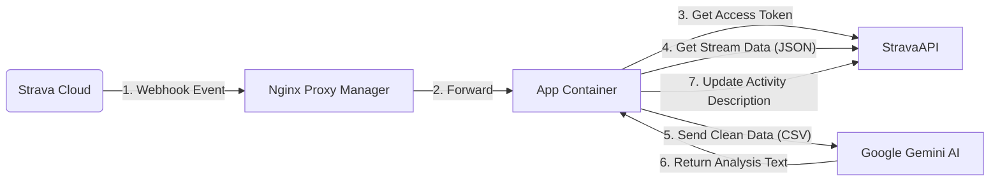

# 🏃‍♂️ AI Running Coach - Strava Webhook Integration

Hệ thống "Huấn luyện viên ảo" tự động hóa quy trình phân tích chạy bộ. Hệ thống lắng nghe Webhook từ Strava, sử dụng Google Gemini AI để phân tích dữ liệu chuyên sâu (Pace, Heart Rate, Cadence) và tự động cập nhật nhận xét chuyên môn vào phần mô tả của bài tập trên Strava.

## 🌟 Tính năng Nổi bật
* **Zero-Touch:** Hoạt động hoàn toàn tự động ngay khi upload bài chạy.
* **AI Analysis:** Phân tích dữ liệu từng giây (Streams) để đưa ra chiến thuật, đánh giá vùng nhịp tim (HR Zones).
* **Hot-Reload Config:** Tùy chỉnh tính cách AI (System Instruction), mục tiêu tập luyện qua file `config.json` mà không cần restart server.
* **Strava Optimized:** Định dạng văn bản tối ưu cho Strava Mobile (Sử dụng Emoji, UPPERCASE thay vì Markdown đậm/nghiêng không được hỗ trợ).
* **Cost Efficient:** Tối ưu hóa để chạy miễn phí và ổn định trên gói Free Tier của Gemini API.

---

## 🏗 Kiến trúc Hệ thống (Architecture)

📂 Cấu trúc Dự án
Plaintext
/home/tinhn/repo/AIRuningCoach/
├── Dockerfile              # Môi trường chạy: Python 3.11 Slim (Tối ưu hóa)
├── main.py                 # Logic chính: Webhook Server, Gemini Client, Strava integration
├── requirements.txt        # Các thư viện Python cần thiết
├── .env                    # [QUAN TRỌNG] Chứa API Keys (Không commit file này)
├── config.json             # Cấu hình Prompt & Format (Sửa nóng được)
└── README.md               # Tài liệu hướng dẫn này
🛠 Hướng dẫn Cài đặt & Triển khai
1. Yêu cầu tiên quyết

Docker & Docker Compose đã được cài đặt.

Tài khoản Strava API (có Client ID, Client Secret).

Tài khoản Google AI Studio (có API Key).