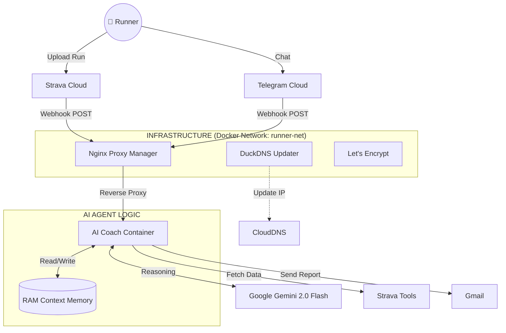

Markdown

# 🏃‍♂️ AI Running Coach (Coach Dyno)
### Autonomous Agentic System v1.1

*A personalized, proactive AI Agent running on Home Lab (Lenovo T440).*

---

## 📖 1. Overview

**Coach Dyno** không chỉ là một chatbot. Đây là hệ thống **AI Agent** có khả năng tự nhận thức ngữ cảnh (Contextual Awareness), vận hành trên Home Lab cá nhân. Nó được thiết kế để "hiểu" dữ liệu tập luyện sâu sắc hơn và đồng hành cùng Runner đạt mục tiêu **Sub 1:45 Half Marathon (2026)**.

### ✨ Key Capabilities
* 🧠 **Contextual Memory:** Nhớ được nội dung hội thoại trước đó (Short-term RAM). Hiểu các câu hỏi nối tiếp (Follow-up questions).
* 📊 **Deep Analysis:** Tự động phát hiện bài chạy mới từ Strava Webhook, phân tích Splits/HR/Cadence ngay lập tức.
* 🛡️ **Decoupled Infrastructure:** Hạ tầng mạng (Nginx/SSL) chạy độc lập với trí tuệ nhân tạo (AI), đảm bảo sự ổn định tối đa.
* 📧 **Professional Reporting:** Gửi email báo cáo chi tiết chuẩn HTML với các chỉ số chuyên sâu.

---

## 🏗️ 2. System Architecture

Hệ thống sử dụng kiến trúc **Monorepo** với thiết kế **Decoupled Infrastructure** (Tách biệt hạ tầng).

📂 Project Structure

Bash
AIRunningCoach/
├── .env                # [SECRET] API Keys, Tokens (GitIgnore)
├── docker-compose.yml  # Main Orchestrator
├── main.py             # API Gateway & Webhook Handler
│
├── infra/              # [INFRASTRUCTURE] - Independent
│   ├── nginx/          # Proxy Config & Database
│   ├── letsencrypt/    # SSL Certificates
│   └── duckdns/        # DDNS Config
│
├── agents/             # [THE BRAIN]
│   └── coach_agent.py  # Logic AI, Memory, Prompting
│
├── tools/              # [THE HANDS]
│   ├── strava_client.py
│   └── notify_tools.py # Notification Senders
│
└── data/               # [DYNAMIC CONFIG]
    └── config.json     # System Instruction & Persona
📝 3. Change Log
Version	Date	Key Highlights
v1.1	Feb 2026	Context & Infra Update. Tách biệt hạ tầng Nginx. Thêm trí nhớ hội thoại (Memory). Hỗ trợ WireGuard (Port 4500). Bảo mật Token bằng .env.
v1.0	Jan 2026	Genesis. Phiên bản đầu tiên. Tích hợp Strava Webhook. Phân tích cơ bản với Gemini 1.5.
🗺️ 4. Roadmap: The Agentic Evolution
🐣 Phase 1: Foundation (Completed)

[x] Xây dựng hạ tầng Docker & Nginx Proxy.

[x] Kết nối Strava Webhook nhận dữ liệu chạy.

[x] Tích hợp Gemini 1.5 Pro phân tích cơ bản.

[x] Hệ thống báo cáo qua Email HTML & Telegram.

🧠 Phase 2: Cognition & Memory (Current)

[x] Monorepo Structure: Tách biệt hạ tầng và logic ứng dụng.

[x] Contextual Memory (RAM): Bot nhớ được hội thoại ngắn hạn.

[ ] Reflexion: Agent tự đánh giá lại lời khuyên nếu người dùng phản hồi tiêu cực.

[ ] Error Recovery: Tự động retry khi Strava API lỗi hoặc Gemini quá tải (429).

🏛️ Phase 3: Long-term Memory & RAG (Q2 2026)

[ ] Database Integration: Chuyển từ RAM sang SQLite/PostgreSQL.

[ ] RAG (Retrieval-Augmented Generation): "So sánh bài chạy hôm nay với tháng trước".

[ ] Knowledge Base: Nạp kiến thức chạy bộ chuẩn (Jack Daniels) vào bộ nhớ.

👁️ Phase 4: Perception (Late 2026)

[ ] Vision: Phân tích ảnh chụp màn hình Garmin/Coros.

[ ] Voice: Tích hợp Gemini Live chat voice khi chạy.

👨‍💻 5. Development Guidelines
🚀 Deployment

Khởi động toàn bộ (Full Start):

Bash
sudo docker-compose up -d --build
Cập nhật AI Logic (Zero Downtime Infra):

Bash
# Sử dụng alias 'update-ai' hoặc:
docker-compose up -d --no-deps --build ai-coach
🔒 Secret Management

Never commit .env: File này chứa API Key.

Log Sanitization: Kiểm tra kỹ khi log raw JSON để tránh lộ token.

📜 Monitoring

Xem log thời gian thực:

Bash
docker logs -f airunningcoach
✅ 6. Immediate Todo List
High Priority 🔴

[ ] Backup Script: Script tự động zip folder infra/ upload lên Google Drive.

[ ] Persona Tuning: Cập nhật config.json để Coach Dyno "có hồn" hơn.

[ ] Fix Strava Token: Cơ chế Refresh Token tự động mạnh mẽ hơn.

Medium Priority 🟡

[ ] Dashboard UI: Web xem biểu đồ đơn giản (Streamlit).

[ ] Health Check: Endpoint /health cho Uptime Kuma.

Last Updated: Feb 2026 | Project Owner: TinhN

