<div align="center">

# 🏃‍♂️ Personal AI OS
### Autonomous Agentic System v2.3.0 (The Coach Dyno Edition)


*A proactive, context-aware AI Agent operating on a lightweight Home Lab (Lenovo T440), evolving from a reactive chatbot to a fully autonomous orchestrator.*

</div>

---

## 📖 1. Project Introduction

**Personal AI OS** is a specialized, multi-tenant capable AI Agent system. Currently incarnated as **Coach Dyno**, its primary mission is to autonomously guide the user towards a **Sub 1:45 Half Marathon (March 2026)**.

**The Agentic Core:**
Unlike traditional chatbots that rely on "prompt stuffing", this system is built on the four pillars of an Autonomous Agent:
1. **Perception:** Real-time ingestion of Strava webhooks, Telegram chats, and Cron-based temporal awareness.
2. **Memory (Dual-System):** Combining structured sports science data (SQLite) with semantic long-term memory (ChromaDB RAG).
3. **Reasoning:** Leveraging Google's Gemini 2.0 Flash for low-latency, high-IQ analysis and Goal Confidence Score (GCS) forecasting.
4. **Action:** Updating dashboards, interacting on Telegram, and managing physical training loads without human prompting.

**Core Philosophy: "Zero-Heavy Local Processing"**
To operate smoothly on an 8GB RAM machine, heavy LLM reasoning is offloaded to Google APIs, while local resources are strictly reserved for the Vector Database (ChromaDB) and lightweight state management (FastAPI).

---

## 🏗️ 2. System Architecture

The system utilizes a decoupled Modular Monolith infrastructure.

```mermaid
graph TD
    %% External Inputs
    User(("🏃 Runner")) -->|"Telegram Chat"| Telegram["Telegram Webhook"]
    StravaCloud["Strava Cloud"] -->|"Activity Webhook"| Nginx

    %% Infra
    subgraph "INFRASTRUCTURE (runner-net)"
        Nginx["Nginx Proxy Manager"]
        SSL["Let's Encrypt"]
    end

    %% Application
    subgraph "MODULAR MONOLITH (FastAPI)"
        Gateway["main.py Gateway"]
        
        subgraph "API Layer"
            HookRouter["Webhooks"]
            AdminRouter["Admin/User UI"]
        end
        
        subgraph "Dual-Memory System"
            DB[("SQLite (TRIMP/ACWR)")]
            VectorDB[("ChromaDB (RAG)")]
        end
        
        subgraph "Domain Logic (Agents)"
            Coach["Coach Agent"]
            StravaAPI["Strava Client"]
        end
        
        subgraph "Background Workers"
            Cron["APScheduler"]
        end
    end

    %% External LLM
    Gemini["Google Gemini 2.0 API"]

    %% Connections
    Telegram --> Nginx
    Nginx -->|"Reverse Proxy :8000"| Gateway
    Gateway --> HookRouter
    Gateway --> AdminRouter
    
    HookRouter --> Coach
    Cron -->|"Trigger Harvest/Briefing"| Coach
    Coach <-->|"Math/Metrics"| DB
    Coach <-->|"Semantic Context"| VectorDB
    Coach <-->|"Fetch CSV/Stats"| StravaAPI
    Coach <-->|"Reasoning & Tool Use"| Gemini

```



---

## 🧠 3. The Dual-Memory Engine

Personal AI OS separates data into two distinct tiers to optimize context window and reasoning speed:

* **Tier 1: Relational (SQLite - `data/os_core.db`)**
* Tracks high-precision mathematical states: Acute/Chronic Workload Ratios (ACWR), TRIMP loads, and Goal Confidence Scores (GCS).


* **Tier 2: Vector Semantic (ChromaDB - `data/chroma_db`)**
* Stores unstructured historical knowledge. When the user asks a question, the Agent queries this RAG database to recall specific form corrections, past injuries, and historical run contexts.


---

## 💻 4. Deployment & Operation

### Prerequisites

1. Docker and Docker Compose installed.
2. A `.env` file at the root containing API Keys (Gemini, Telegram, Strava, SMTP) and `CHROMADB_CACHE_DIR` routing.

### Quick Start

To spin up the entire OS (Application + Nginx Proxy):

```bash
docker-compose up -d --build

```

### Dashboards

* **Admin Control Center:** `https://<your-domain>/admin` (System Prompts, Log Tracking, Model Switching).
* **User Performance Dashboard:** `https://<your-domain>/dashboard` (Visualizing ACWR, TRIMP trends, and GCS).

---

## 🗺️ 5. The Agentic Evolution Roadmap 2.0

### ✅ Phase 1 & 2: The Sensing Foundation (Completed - v2.3.0)

* [x] Hybrid Strava Sync (Webhooks + Auto-Harvest with 5s Downsampling).
* [x] Dual-Memory architecture (SQLite + ChromaDB RAG).
* [x] Automated Goal Confidence Score (GCS) extraction and visualization.
* [x] Smart Retry mechanisms for 429 API rate limits.

### 🚀 Phase 3: The Tool-Using Expert (Current Focus)

* [ ] **Automatic Function Calling (AFC):** Transition from "prompt stuffing" to dynamic tool usage. Equip the Agent with python functions (`get_acwr()`, `query_chromadb()`, `get_strava_stats()`).
* [ ] **Dynamic Prompting:** The Agent decides *when* and *what* data to fetch based on user intent, drastically reducing token usage.
* [ ] **Self-Correction:** The Agent learns to retry with different parameters if a tool returns an error.

### 🔮 Phase 4: Proactive Autonomy (Upcoming)

* [ ] **Proactive Interventions:** Background workers monitor ACWR. If injury risk spikes (>1.5), the Agent autonomously initiates a Telegram conversation to enforce a rest day.
* [ ] **Self-Reflection Loop:** A weekly chron-job where the Agent evaluates its past advice against actual Strava outcomes, adjusting its own configuration and training philosophy dynamically.

### 🌐 Phase 5: The Multi-Agent Ecosystem (Late 2026)

* [ ] **Supervisor Orchestrator:** Convert `main.py` into a Router Agent that delegates tasks.
* [ ] **Finance Agent:** Add personal budget tracking and running gear depreciation analysis.
* [ ] **News Agent (Trafilatura):** Implement RSS-based, zero-heavy crawling to ingest sports science articles directly into the RAG memory.

---

<div align="center">
<sub>Designed and built for Personal Home Lab Operations.</sub>
</div>