<div align="center">

# 🏃‍♂️ Personal AI OS (Coach Dyno)
### Autonomous Agentic System v2.0 (Modular Monolith)


*A personalized, context-aware AI Agent operating on a lightweight Home Lab (Lenovo T440).*

</div>

---

## 📖 1. Project Introduction

**Personal AI OS (Coach Dyno)** is not just a standard chatbot. It is a proactive, context-aware AI Agent designed to run 24/7 on a low-resource Home Lab. Currently specializing as a **Running Coach**, its primary mission is to guide the user towards a **Sub 1:45 Half Marathon (March 2026)**.

**Core Philosophy: "Zero-Heavy Local Processing"**
To operate smoothly on an 8GB RAM machine, the system is designed to be completely lightweight:
* **Offloaded Heavy-lifting:** LLM reasoning is completely offloaded to Google Gemini API.
* **Lean Local Footprint:** Uses `SQLite` instead of heavy database servers. Uses HTTP webhooks and RSS instead of resource-heavy browser automation.
* **Modular Monolith:** Highly organized codebase allowing easy integration of new Agents (e.g., Finance, News) without spinning up multiple Docker containers.

---

## 🏗️ 2. System Architecture

The system utilizes a decoupled infrastructure where networking (Nginx/SSL) is isolated from the application logic.

```mermaid
graph TD
    %% External Inputs
    User(("🏃 Runner")) -->|"Telegram Chat"| Telegram["Telegram Webhook"]
    StravaCloud["Strava Cloud"] -->|"Activity Webhook"| Nginx

    %% Infra
    subgraph "INFRASTRUCTURE (runner-net)"
        Nginx["Nginx Proxy Manager"]
        SSL["Let's Encrypt"]
    end

    %% Application
    subgraph "MODULAR MONOLITH (FastAPI)"
        Gateway["main.py Gateway"]
        
        subgraph "Routers (API Layer)"
            HookRouter["Webhooks"]
            AdminRouter["Admin UI"]
        end
        
        subgraph "Services & Core"
            Cron["APScheduler"]
            State["Global App State"]
            DB[("SQLite Memory DB")]
        end
        
        subgraph "Domain Logic (Agents)"
            Coach["Coach Agent"]
            StravaAPI["Strava Integration"]
        end
    end

    %% External LLM
    Gemini["Google Gemini 2.0 API"]

    %% Connections
    Telegram --> Nginx
    Nginx -->|"Reverse Proxy :8000"| Gateway
    Gateway --> HookRouter
    Gateway --> AdminRouter
    
    HookRouter --> Coach
    Cron -->|"Trigger Harvest/Briefing"| Coach
    Coach <-->|"Context/History"| DB
    Coach <-->|"Fetch Raw Data"| StravaAPI
    Coach <-->|"Prompt Reasoning"| Gemini

```



---

## 📂 3. Project Structure

The project has been refactored from a flat-script structure into a scalable **Modular Monolith**:

```text
Personal_AI_OS/
├── app/                        # Main Application Package
│   ├── main.py                 # Lightweight Entry Point & FastAPI Init
│   ├── core/                   # ⚙️ SHARED INFRASTRUCTURE
│   │   ├── config.py           # Centralized Configuration Loader
│   │   ├── database.py         # SQLite Memory Manager
│   │   ├── logging_conf.py     # Centralized Logging Buffer
│   │   ├── notification.py     # Telegram & Email senders
│   │   └── state.py            # Global App State (Pause/Resume)
│   ├── services/               # 🔄 BACKGROUND SERVICES
│   │   └── scheduler.py        # APScheduler (Cron jobs)
│   ├── routers/                # 🌐 API ENDPOINTS
│   │   ├── admin.py            # Admin Dashboard UI Controller
│   │   └── webhooks.py         # Strava & Telegram event listeners
│   └── agents/                 # 🧠 DOMAIN LOGIC
│       └── coach/              # Coach Agent Enclave
│           ├── agent.py        # AI Reasoning & Prompt Engineering
│           ├── harvest.py      # Automated Data Harvester
│           ├── strava_client.py# Strava API Wrapper
│           └── utils.py        # Running metrics math (TRIMP, EF)
├── data/                       # Local Storage (SQLite, JSON Configs)
├── infra/                      # Independent Nginx & DuckDNS Configs
├── templates/                  # HTML Templates for Admin UI
├── docker-compose.yml          # Container Orchestration
└── .env                        # [SECRET] Environment Variables

```

---

## 💻 4. Technologies

* **Backend Framework:** FastAPI (Asynchronous, fast, and lightweight).
* **AI & LLM:** Google Generative AI (Gemini 2.0 Flash) for cost-effective, high-speed reasoning.
* **Task Scheduling:** APScheduler (Running within the same FastAPI process to save RAM).
* **Database:** SQLite (Zero-configuration, serverless database for chat history).
* **Containerization:** Docker & Docker Compose.
* **Networking:** Nginx Proxy Manager + Let's Encrypt (Automated SSL) + DuckDNS.

---

## 🚀 5. Deployment Guidelines

### Prerequisites

1. Docker and Docker Compose installed.
2. A `.env` file created at the root directory containing all API Keys (Gemini, Telegram, Strava, Email, Admin Auth). *See `config.example.json` for hints.*

### Quick Start

To spin up the entire system (Application + Nginx Proxy):

```bash
docker-compose up -d --build

```

### Applying Application Updates (Zero-Downtime Networking)

If you only modify the Python code inside `app/` and want to update the AI without dropping the Nginx network:

```bash
docker-compose up -d --no-deps --build ai-coach

```

### Admin Access

Access the dashboard to change AI Persona, toggle service state, or view live logs:

* Local: `http://localhost:8000/admin`
* Public: `https://<your-domain>/admin`

---

## 🗺️ 6. Roadmap: The Agentic Evolution

### Phase 1: Foundation (Completed)

* [x] Basic Strava Webhook Integration.
* [x] Telegram Bot interface.
* [x] HTML Email reporting.

### Phase 2: Cognition & Restructuring (Current)

* [x] Refactor to Modular Monolith architecture.
* [x] Contextual Memory (SQLite): Agent remembers short-term conversation history.
* [x] Automated Scheduler (Morning Briefings & Auto-Harvest).

### Phase 3: Advanced Intelligence & Stability (Upcoming)

* [ ] **Race Day Persona:** Fine-tune `config.json` to make the AI aware of the exact weeks left until the Sub 1:45 Race Day.
* [ ] **Data Security:** Implement an automated Backup Script for the `data/` directory.
* [ ] **Error Recovery:** Add retry mechanisms for Strava API rate limits and Gemini 429 Overload errors.
* [ ] **RAG Integration:** Implement `LanceDB` for lightweight vector search to compare current runs with historical performances.

### Phase 4: Expansion (Late 2026)

* [ ] Add **Finance Agent** for personal budget tracking.
* [ ] Add **News Agent** using `trafilatura` (RSS-based zero-heavy crawling).

<div align="center">
<sub>Project Owner: TinhN | Maintained for Personal Home Lab Operations</sub>
</div>