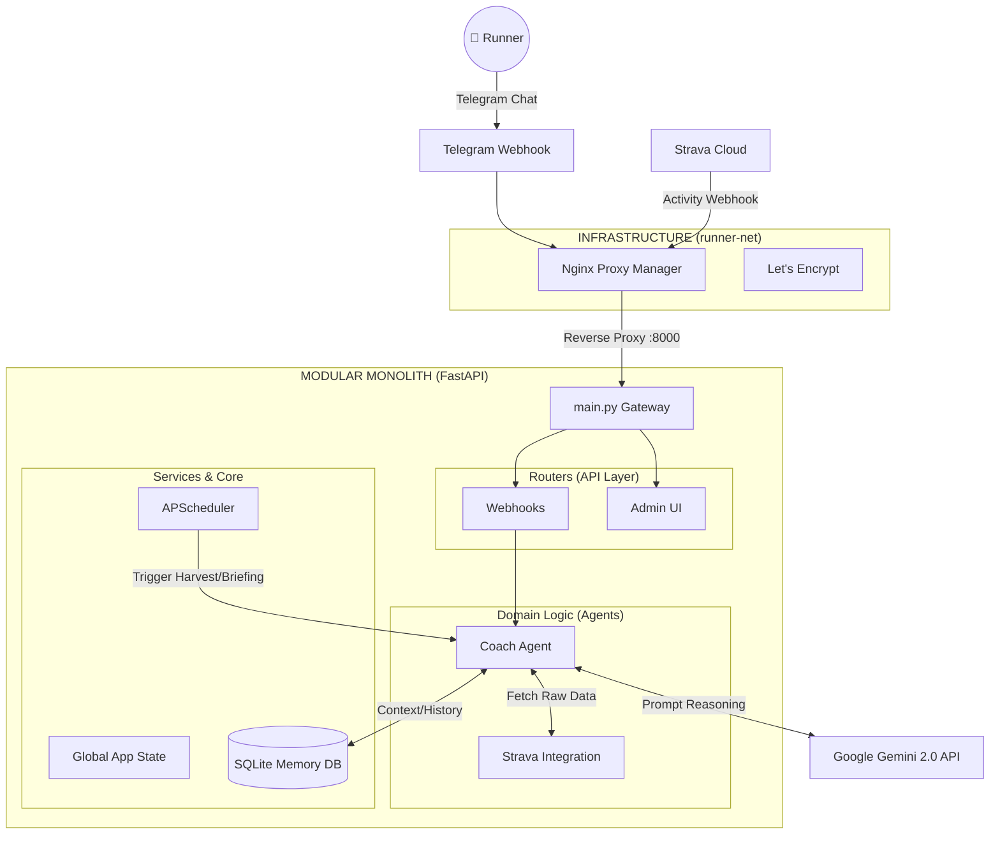

## 🏗️ 2. System Architecture

The system utilizes a decoupled infrastructure where networking (Nginx/SSL) is isolated from the application logic.



---

## 📂 3. Project Structure

The project has been refactored from a flat-script structure into a scalable **Modular Monolith**:

```text
Personal_AI_OS/
├── app/                        # Main Application Package
│   ├── main.py                 # Lightweight Entry Point & FastAPI Init
│   ├── core/                   # ⚙️ SHARED INFRASTRUCTURE
│   │   ├── config.py           # Centralized Configuration Loader
│   │   ├── database.py         # SQLite Memory Manager
│   │   ├── logging_conf.py     # Centralized Logging Buffer
│   │   ├── notification.py     # Telegram & Email senders
│   │   └── state.py            # Global App State (Pause/Resume)
│   ├── services/               # 🔄 BACKGROUND SERVICES
│   │   └── scheduler.py        # APScheduler (Cron jobs)
│   ├── routers/                # 🌐 API ENDPOINTS
│   │   ├── admin.py            # Admin Dashboard UI Controller
│   │   └── webhooks.py         # Strava & Telegram event listeners
│   └── agents/                 # 🧠 DOMAIN LOGIC
│       └── coach/              # Coach Agent Enclave
│           ├── agent.py        # AI Reasoning & Prompt Engineering
│           ├── harvest.py      # Automated Data Harvester
│           ├── strava_client.py# Strava API Wrapper
│           └── utils.py        # Running metrics math (TRIMP, EF)
├── data/                       # Local Storage (SQLite, JSON Configs)
├── infra/                      # Independent Nginx & DuckDNS Configs
├── templates/                  # HTML Templates for Admin UI
├── docker-compose.yml          # Container Orchestration
└── .env                        # [SECRET] Environment Variables

```
